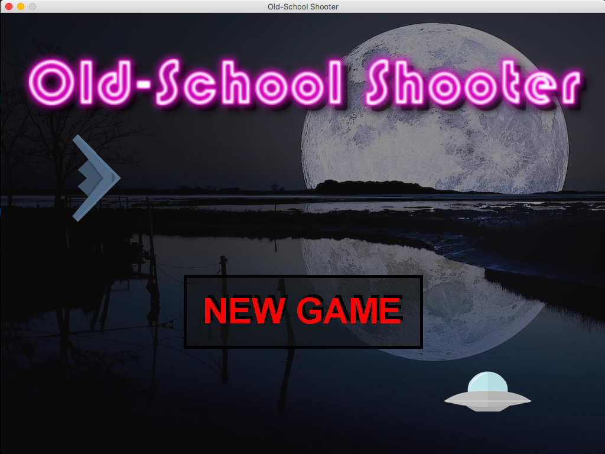
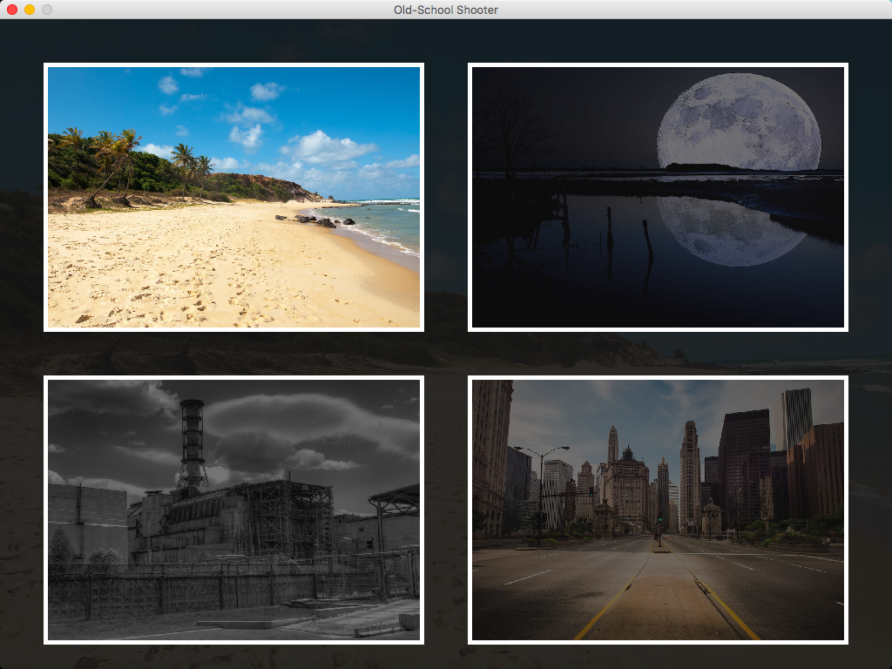
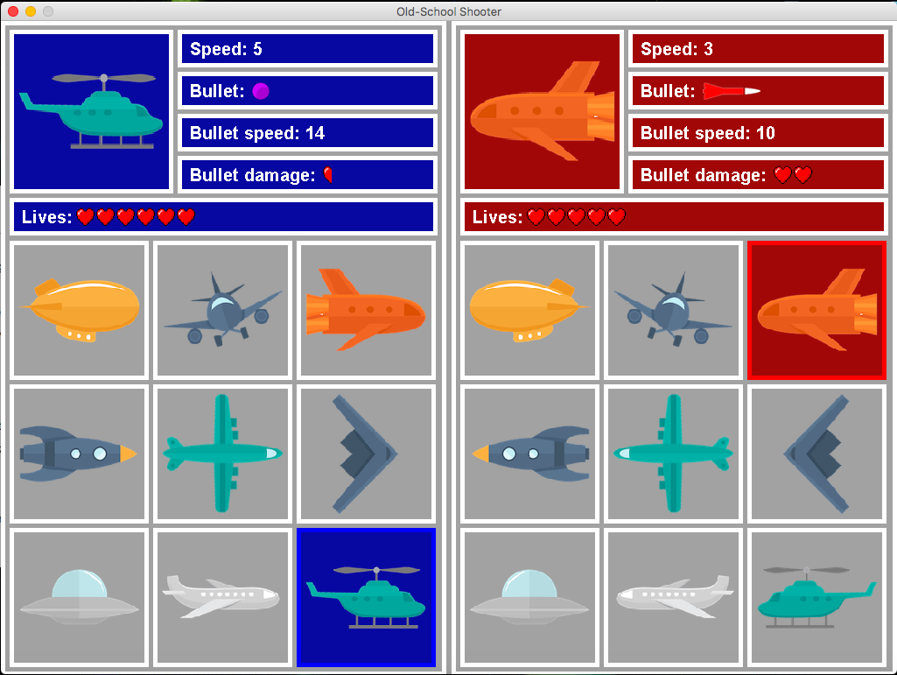
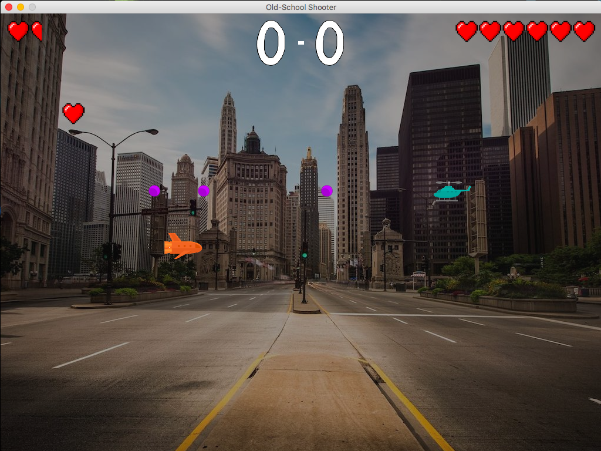
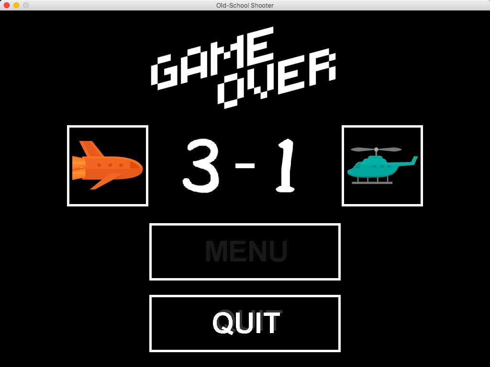

# Old-School Shooter
This game was created for my OOP classes project. The game is designed for 2 people. One play consists of several fights between players. During the game players can shoot the opponent's vehicle, collect falling lives and use their special power.

## Running the game
The game.jar file is located in the `classes` directory.

## Controls
First player:
* moving - WSAD
* enter/shooting - option
* special power - left shift

Second player:
* moving - arrow keys
* enter/shooting - /
* special power - .

## Screenshots

*New Game Window*

*Background Choice Window*

*Hero Choice Window*

*Game Window*

*Game Over Window*

